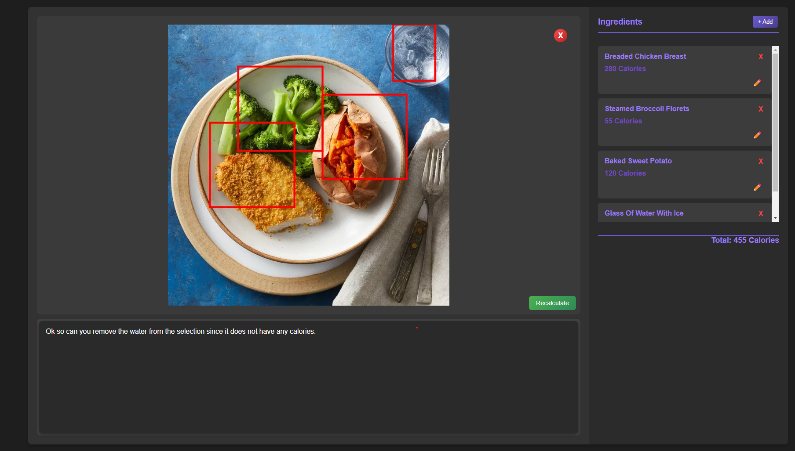

# 🍕 SmartCal – AI-Powered Calorie Estimator  

SmartCal is an **AI-driven calorie tracker** that helps you estimate the calories in your food just by uploading a picture! Inspired by **Cal AI**, this app uses **Anthropic LLM** to analyze your food and give you an editable breakdown of what’s on your plate.  

---

## 🚀 What Can SmartCal Do?  

👉 **Upload a food image** – Just snap a pic, and SmartCal will analyze it!  
👉 **Detects food items & draws boundaries** – AI will outline the different foods in your image.  
👉 **Creates a list of detected foods + estimated calories** – So you can see what’s in your meal.  
👉 **Fully editable food list** – Rename, adjust, add, or remove items if the AI got something wrong.  
👉 **Customize results with a prompt** – Want the AI to focus on something specific? Add a prompt to fine-tune the results!  

---

## 🤝 How to Get Started  

### 1️⃣ Clone the Project  
```bash
git clone https://github.com/Eggmen11/SmartCal.git
cd smartcal
```

### 2️⃣ Install Dependencies  
```bash
npm install
```

### 3️⃣ Set Up Your API Key  
You'll need an **Anthropic API Key** to use the AI. Create a `.env` file and add:  
```bash
ANTHROPIC_API_KEY=your-api-key-here
```

### 4️⃣ Run SmartCal  
```bash
node app.mjs
```
Then open **`http://localhost:3000`** in your browser. 🚀  

---

## 📸 Here's What It Looks Like   
  

---

## 🎯 What Inspired This?

SmartCal was inspired by **[Cal AI](https://www.calai.app/)**, but this is an independent project built to explore AI-based food tracking in a **customizable way**. Additionally, this project was influenced by [Anthropic's Object Detection repository](https://github.com/anthropic/object-detection), which provided inspiration for the AI-driven approach to food recognition.


